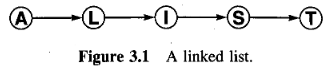
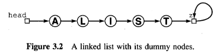
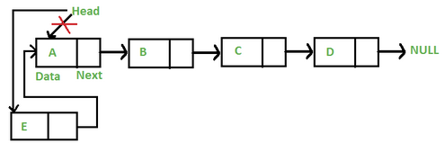

# Linked Lists
- Not a primitive data structure in C
- Primary advantage over arrays is that *linked lists can grow and shrink in size during their lifetime*.
	- Their maximum size need not be known in advance.
- Second advantage is that they provide flexibility in allowing items to be rearranged efficiently.
	- gained at the expense of quick access to any arbitrary item in the list
- A ***Linked List*** is a set of items organized sequentially, just like an array. Except, in a linked list, we use an explicit arrangement in which each item is part of a **node** that also contains a **link** to the next node.

- For our convention, we add a nextra node, `z`, so that the last node of the list will point to `z`, and `z` will point to itself.

- When rearranging the order of our list, we also rearrange our **links**

## Inserting an item into a linked list
### At the front of the linked list
- The new node is always added before the head of the given Linked List. And newly added node becomes the new head of the Linked List.
- For example if the given Linked List is `10->15->20->25` and we add an item 5 at the front, then the Linked List becomes `5->10->15->20->25`. 
- Let us call the function that adds at the front of the list is `push()`. The `push()` must receive a pointer to the head pointer, because push must change the head pointer to point to the new node.

#### Algorithm
Given a reference (pointer to pointer) to the head of the list and an int,
inserts a new node on the front of the list.

<code>
void push():
	1. Allocate node
	2. Put in the data
	3. Make next of new node as head
	4. Move the head to point to the new node
</code>