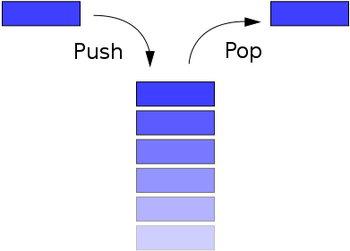

# Stack
A *stack* is a collection of items (integers, floats, char, etc.) which allows the following two operations:
- `push(i)`: adds an item `i` to the collection
- `pop()`: returns and removes the LATEST item, provided the stack is **not empty**.

Besides these two operations, a stack can also support the following operations
- `peek()`: returns the latest item from the collection without removing it
- `size()`: returns the number of items in the stack

When imagining a stack, think of a stack of plates in school. We can only see the top of the stack, and the rest of the plates are abstracted. We can only take the top of the stack, and we can't reach the very bottom item, unless we take out all of the plates from the stack.



### Pseudocode (*in C++/Java*)
```
int MAX_SIZE = 5, top_of_stack = -1;
int stackArray[MAX_SIZE]; // an array which simulates the stack

function push(int val)
	if(top_of_stack == MAX_SIZE - 1) then
		"Cannot push! Stack is full!";
	else
		stackArray[++top_of_stack] == val;

function pop()
	if(top_of_stack == -1) then
		"Cannot pop! Stack is empty!"
	else
		return stackArray[top_of_stack--];

function peek()
	if(top_of_stack == -1) then
		"Cannot peek! Stack is empty!";
	else
		return stackArray[top_of_stack];

function size()
	return (top_of_stack + 1);
```