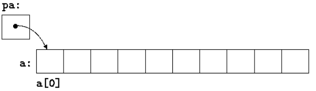
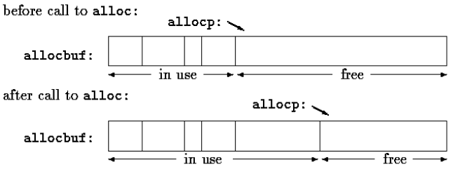

# Table of contents
- [x] [What is a pointer?](https://github.com/carrliitos/CPrograms/tree/master/TutorialIntroduction/PointersAndArrays#what-is-a-pointer)
- [x] [Pointers and Addresses](https://github.com/carrliitos/CPrograms/tree/master/TutorialIntroduction/PointersAndArrays#pointers-and-addresses)
- [x] [Pointers and Function Arguments](https://github.com/carrliitos/CPrograms/tree/master/TutorialIntroduction/PointersAndArrays#pointers-and-function-arguments)
- [x] [Pointers and Arrays](https://github.com/carrliitos/CPrograms/tree/master/TutorialIntroduction/PointersAndArrays#pointers-and-arrays)
- [ ] Address Arithmetic
- [ ] Character Pointers and Functions
- [ ] Pointer Arrays; Pointers to Pointers
- [ ] Multi-dimensional Arrays
- [ ] Initialization of Pointer Arrays
- [ ] Pointers vs. Multi-dimensional Arrays
- [ ] Command-line Arguments
- [ ] Pointers to Functions
- [ ] Complicated Declarations

## What is a pointer?
- `Pointer`
	- a variable that contains the address of a variable.
	- used a lot in C because they sometimes are the only way to express a computation
	- usually lead to a more compact and efficient code
	- have been lumped with the `goto` statement
		- if used correctly, pointers can achieve clarity and simplicity
	- type `void *` (pointer to void) replaces `char *` as the proper type for a generic pointer

### Pointers and addresses
- A typical machine has an array of consecutively numbered or addressed memory cells that may be maniupualted individually or in contiguous groups
- **A pointer is a group of cells that can hold an address**
- Example:
	
	<code>p = &c;</code>

- This example shows that *we assign the address of **c** to the variable **p**, and **p** is said to "point to" **c***
	- (very similar to how references work in JAVA)
- The unary operator `*` is the *indirection* or *dereferencing* operator
	- when applied to a pointer, it access the object the pointer points to. (Mind. Blown.)
- One example of how to declare a pointer is [here](https://github.com/carrliitos/CPrograms/blob/master/TutorialIntroduction/PointersAndArrays/DeclareAPointer.c)
	- `int *ip;` is intended as a mnemonic; it says, "*the expression `*ip` is an int*"
	- The syntax of the declaration for a variable mimics the syntax of expression in which the variable might appear.
	Similarly, this same syntax is applied to function declarations;
	- `double *dp, atof(char *);`
		- this says that "*an expression `*dp` and `atof(s)` have values of `double`, and that argument of `atof()` is a pointer to `char`*".
- Important note: **Every pointer points to a specific data type**
- More examples:
	
	- `*ip = *ip + 10;`

		- If `ip` points to the integer `x`, then `*ip` can occur in any context where `x` could, so the above code increments `*ip` by 10.
		- The unary operators `*` and `&` bind more tightly than arithmetic operators, so the assignment `y = *ip + 1` takes whatever `ip` points at, adds 1, and assigns the result to `y`, while `*ip += 1` increments what `ip` points to, as do `++*ip` and `(*ip)++`.

#### Summarizing `*` and `&`
- **`*` abd `&` as *type modifiers***
	- `int i` declares an int
	- `int *p` declares a pointer to an int
	- `int &r = 1` declares a reference to an int, and initializes it to reference `i`
		- *C++ only. Note that references must be assignet at initialization, therefore `int &r`; is not possible*
- Similarly:
	- `void foo(int i)` declares a function taking an int (by value, i.e. as a copy)
	- `void foo(int *p)` declares a function taking a pointer to an int
	- `void foo(int &r)` declares a function taking an int by reference (Again, C++ only)

- **`*` and `&` as *operators***
	- `foo(i)` calls `foo(int i)`. The parameter is passes as a copy
	- `foo(*p)` derefences the int pointer `p` and calls `foo(int i)` with int pointer to by `p`
	- `foo(&i)` takes the address of the int `i` and calls `foo(int *i)` with that address
- (**tl;dr**):
	- `*` can be either a dereference operator, or part of the pointer declaration syntax
	- `&` can be either the address-of operator or (in C++) part of the reference declaration syntax	

### Pointers and Function Arguments
- C passes arguments to functions **by value**, therefore there is no direct way for the called function to alter the variable in the calling function. Hence, the function call `swap(a, b)`, where `swap()` is a function that swaps the values of both variables, is incorrect. 
- To obtain the desired effect, we do the correct function call as `swap(&a, &b);` where `&a` and `&b` are pointers to `a` and `b` since `&` produces the address of a variable.
- Example of a `swap()` function where the parameters are declared as pointers can be seen [here](https://github.com/carrliitos/CPrograms/blob/master/TutorialIntroduction/PointersAndArrays/Swap.c) and [visually](https://github.com/carrliitos/CPrograms/blob/master/TutorialIntroduction/PointersAndArrays/img/swap.png)
- Pointer arguments enable a function to access and change objects in the function that called it.
	- [Example](https://github.com/carrliitos/CPrograms/blob/master/TutorialIntroduction/PointersAndArrays/GetInt.c)

### Pointers and Arrays
- The pointer version will in general be faster, but until initiated, will be somewhat harder to understand.
- Example:

	<code>
		int a[10]; // we declare an array a of size 10
		int* pa; // we declare pa as a pointer to an integer
		pa = &a[0]; // we set pa to point to element 0 of a; that is, pa contains the address of a[0]
	</code>

- Note: one difference between an array name and a pointer;
	- A **pointer** is a variable, so `pa = a` and `pa++` are legal.
	- An **array name** is not a variable; constructors like `a = pa` and `a++` are illegal

- When an array name is passed to a function, what is passed is the location of the initial element.
- [Example](https://github.com/carrliitos/CPrograms/blob/master/TutorialIntroduction/PointersAndArrays/ArrayPassedToFunction.c)
- Formal parameters in a function definition, `char s[];` and `char *s;` are equivalent; we prefer the latter because it says more explicitly that the variable is a pointer.

### Address Arithmetic
- Simplest forms of pointer or address arithmetic:
	- if `p` is a pointer, then `p++` increments p to point to the next element, and `p += i` increments it to point i elements beyond where it currently does. 
- We illustrate with a rudimentary [storage allocator](https://github.com/carrliitos/CPrograms/blob/master/TutorialIntroduction/PointersAndArrays/StorageAllocator.c)
	- There are two routines:
		- `alloc(n)` returns a pointer to n consecutive character positions, which can be used by the caller of `alloc()` for storing characters.
		- `afree(p)` releases the storage thus acquired so it can be re-used later.
	- calls to `afree()` must be made in the opposite order to the calls made on `alloc()` -- the storage managed by both functions is a **stack**.
	- The easiest implementation is to have `alloc()` hand out pieces of a large character array that we will call `allocbuf[]`. This is a **private** array to `alloc()` and `afree()` -- which means we can declare it as static.
		- How much `allocbuf[]` has been used is needed.
		- we accomplish this by using a pointer called `allocp` that points to the next free element.

- [Pointer subtraction](https://github.com/carrliitos/CPrograms/blob/master/TutorialIntroduction/PointersAndArrays/PointerSubtraction.c) is also valid.
	- if `p` and `q` point to elements of the same array, and `p < q`, then `q - p + 1` is the number of elements from `p` to `q` inclusive.